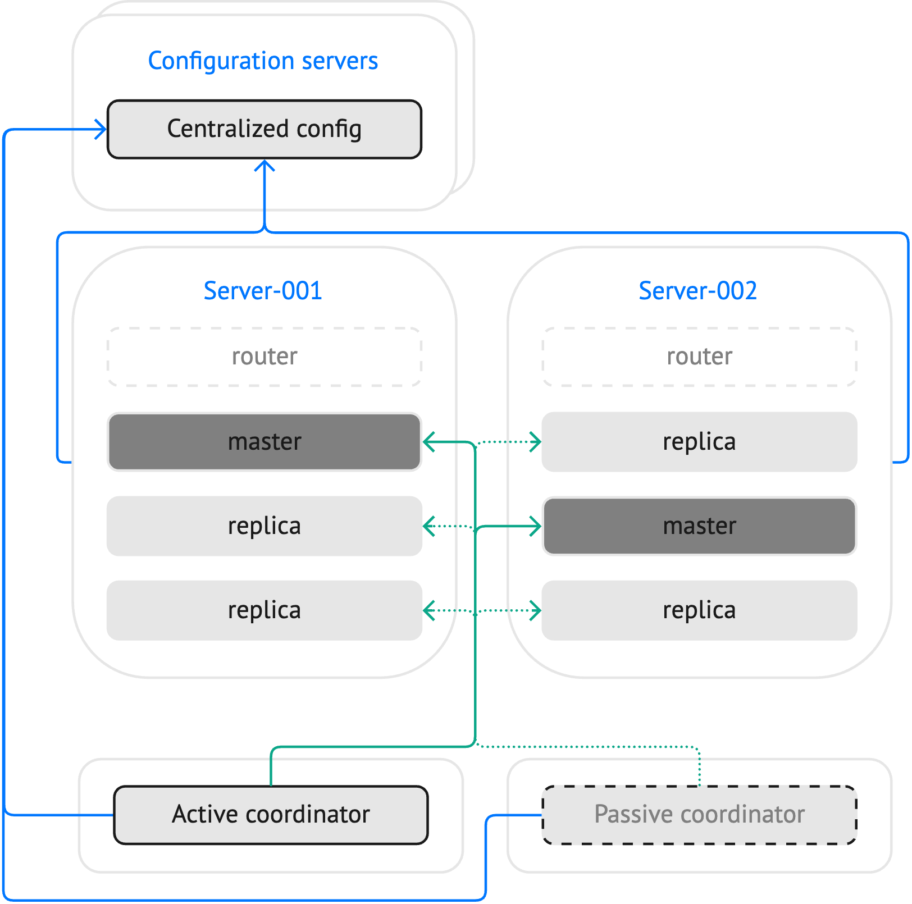

.. _repl_supervised_failover:

Supervised failover
===================

..  admonition:: Enterprise Edition
    :class: fact

    Supervised failover is supported by the `Enterprise Edition <https://www.tarantool.io/compare/>`_ only.

**Example on GitHub**: `supervised_failover <https://github.com/tarantool/doc/tree/latest/doc/code_snippets/snippets/replication/instances.enabled/supervised_failover>`_

Tarantool provides the ability to control leadership in a replica set using an external failover coordinator.
A failover coordinator reads a cluster configuration from a file or an :ref:`etcd-based configuration storage <configuration_etcd>`, polls instances for their statuses, and appoints a leader for each replica set depending on the availability and health of instances.

To increase fault tolerance, you can run two or more failover coordinators.
In this case, an etcd cluster provides synchronization between coordinators.

|

|

.. _supervised_failover_overview:

Overview
--------

The main steps of using an external failover coordinator for a newly configured cluster might look as follows:

1.  :ref:`Configure a cluster <supervised_failover_configuration>` to work with an external coordinator.
    The main step is setting the ``replication.failover`` option to ``supervised`` for all replica sets that should be managed by the external coordinator.

2.  Start a configured cluster.
    When an external coordinator is still not running, instances in a replica set start in the following modes:

    -   If a replica set is already :ref:`bootstrapped <replication_stages>`, all instances are started in read-only mode.
    -   If a replica set is not bootstrapped, one instance is started in read-write mode.

3.  :ref:`Start a failover coordinator <supervised_failover_start_coordinator>`.
    You can start two or more failover coordinators to increase fault tolerance.
    In this case, one coordinator is active and others are passive.

Once a cluster and failover coordinators are up and running, a failover coordinator appoints one instance to be a master if there is no master instance in a replica set.
Then, the following events may occur:

-   If a master instance fails, a failover coordinator performs an automated failover.
-   If an active failover coordinator fails, another coordinator becomes active and performs an automated failover.

..  NOTE::

    Note that a failover coordinator doesn't work with replica sets with two or more read-write instances.
    In this case, a coordinator logs a warning to stdout and doesn't perform any appointments.

.. _supervised_failover_overview_appoint_master:

Appointing a new master instance
~~~~~~~~~~~~~~~~~~~~~~~~~~~~~~~~

After a master instance has been appointed, a failover coordinator monitors the statuses of all instances in a replica set by sending requests each :ref:`probe_interval <configuration_reference_failover_probe_interval>` seconds.
For the master instance, the coordinator maintains a read-write mode deadline, which is renewed periodically each :ref:`renew_interval <configuration_reference_failover_renew_interval>` seconds.
If all attempts to renew the deadline fail during the specified time interval (:ref:`lease_interval <configuration_reference_failover_lease_interval>`), the master switches to read-only mode.
Then, the coordinator appoints a new instance as the master.

..  NOTE::

    :ref:`Anonymous replicas <configuration_reference_replication_anon>` are not considered as candidates to be a master.

If a remote etcd-based storage is used to maintain the state of failover coordinators, you can also perform a :ref:`manual failover <supervised_failover_manual>`.

.. _supervised_failover_overview_fault_tolerance:

Active and passive coordinators
~~~~~~~~~~~~~~~~~~~~~~~~~~~~~~~

To increase fault tolerance, you can :ref:`run <supervised_failover_start_coordinator>` two or more failover coordinators.
In this case, only one coordinator is active and used to control leadership in a replica set.
Other coordinators are passive and don't perform any read-write appointments.

To maintain the state of coordinators, Tarantool uses a stateboard -- a remote etcd-based storage.
This storage uses the same connection settings as a :ref:`centralized etcd-based configuration storage <configuration_etcd>`.
If a cluster configuration is stored in the ``<prefix>/config/*`` keys in etcd, the failover coordinator looks into ``<prefix>/failover/*`` for its state.
Here are a few examples of keys used for different purposes:

-   ``<prefix>/failover/info/by-uuid/<uuid>``: contains a state of a failover coordinator identified by the specified ``uuid``.
-   ``<prefix>/failover/active/lock``: a unique identifier (UUID) of an active failover coordinator.
-   ``<prefix>/failover/active/term``: a kind of fencing token allowing to have an order in which coordinators become active (took the lock) over time.
-   ``<prefix>/failover/command/<id>``: a key used to perform a :ref:`manual failover <supervised_failover_manual>`.

.. _supervised_failover_configuration:

Configuring a cluster
---------------------

To configure a cluster to work with an external failover coordinator, follow the steps below:

#.  (Optional) If you need to run :ref:`several failover coordinators <supervised_failover_overview_fault_tolerance>` to increase fault tolerance, set up an etcd-based configuration storage, as described in :ref:`configuration_etcd`.

#.  Set the :ref:`replication.failover <configuration_reference_replication_failover>` option to ``supervised``:

    ..  literalinclude:: /code_snippets/snippets/replication/instances.enabled/supervised_failover/source.yaml
        :language: yaml
        :start-at: replication:
        :end-at: failover: supervised
        :dedent:

#.  Grant a user used for replication :ref:`permissions <configuration_credentials_managing_users_roles_granting_privileges>` to execute the ``failover.execute`` function:

    ..  literalinclude:: /code_snippets/snippets/replication/instances.enabled/supervised_failover/source.yaml
        :language: yaml
        :start-at: credentials:
        :end-at: failover.execute
        :dedent:

    .. note::

        In Tarantool 3.0 and 3.1, the configuration is different and the function
        must be created in the application code. See :ref:`supervised_failover_configuration_with_role` for details.

#.  (Optional) Configure options that control how a failover coordinator operates in the :ref:`failover <configuration_reference_failover>` section:

    ..  literalinclude:: /code_snippets/snippets/replication/instances.enabled/supervised_failover/source.yaml
        :language: yaml
        :start-after: failover: supervised
        :end-before: groups
        :dedent:

You can find the full example on GitHub: `supervised_failover <https://github.com/tarantool/doc/tree/latest/doc/code_snippets/snippets/replication/instances.enabled/supervised_failover>`_.

.. _supervised_failover_configuration_with_role:

Tarantool 3.0 and 3.1 configuration
~~~~~~~~~~~~~~~~~~~~~~~~~~~~~~~~~~~

Before version 3.2, Tarantool used another mechanism to grant execute access to Lua
functions. In Tarantool 3.0 and 3.1, the ``credentials`` configuration section
should look as follows:

.. code-block:: yaml

    # Tarantool 3.0 and 3.1
    credentials:
      users:
        replicator:
          password: 'topsecret'
          roles: [ replication ]
          privileges:
          - permissions: [ execute ]
            functions: [ 'failover.execute' ]

Additionally, you should create the ``failover.execute`` function in the application code.
For example, you can create a :ref:`custom role <application_roles>` for this purpose:

.. code-block:: lua

    -- Tarantool 3.0 and 3.1 --
    -- supervised_instance.lua --
    return {
        validate = function()
        end,
        apply = function()
            if box.info.ro then
                return
            end
            local func_name = 'failover.execute'
            local opts = { if_not_exists = true }
            box.schema.func.create(func_name, opts)
        end,
        stop = function()
            if box.info.ro then
                return
            end
            local func_name = 'failover.execute'
            if not box.schema.func.exists(func_name) then
                return
            end
            box.schema.func.drop(func_name)
        end,
    }

Then, enable this role for all storage instances:

.. code-block:: yaml

    # Tarantool 3.0 and 3.1
    roles: [ 'supervised_instance' ]

.. _supervised_failover_start_coordinator:

Starting a failover coordinator
-------------------------------

To start a failover coordinator, you need to execute the ``tarantool`` command with the :ref:`failover <tarantool_cli_failover>` option.
This command accepts the path to a cluster configuration file:

..  code-block:: console

    tarantool --failover --config instances.enabled/supervised_failover/config.yaml

If a cluster's configuration is stored in etcd, the ``config.yaml`` file contains :ref:`connection options for the etcd storage <etcd_local_configuration>`.

You can run two or more failover coordinators to increase fault tolerance.
In this case, only one coordinator is active and used to control leadership in a replica set.
Learn more from :ref:`supervised_failover_overview_fault_tolerance`.

.. _supervised_failover_manual:

Performing manual failover
--------------------------

If an etcd-based storage is used to maintain the state of failover coordinators, you can perform a manual failover.
External tools can use the ``<prefix>/failover/command/<id>`` key to choose a new master.
For example, the tt utility provides the :ref:`tt cluster failover <tt-cluster-failover>` command for managing a supervised failover.
